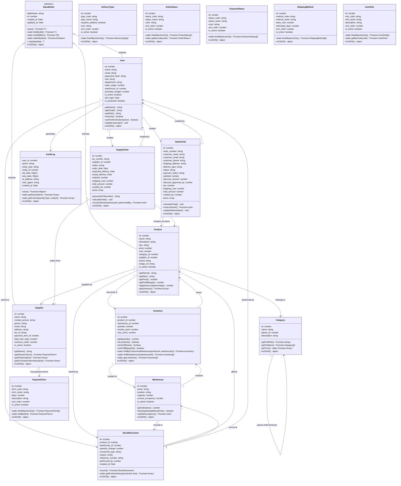
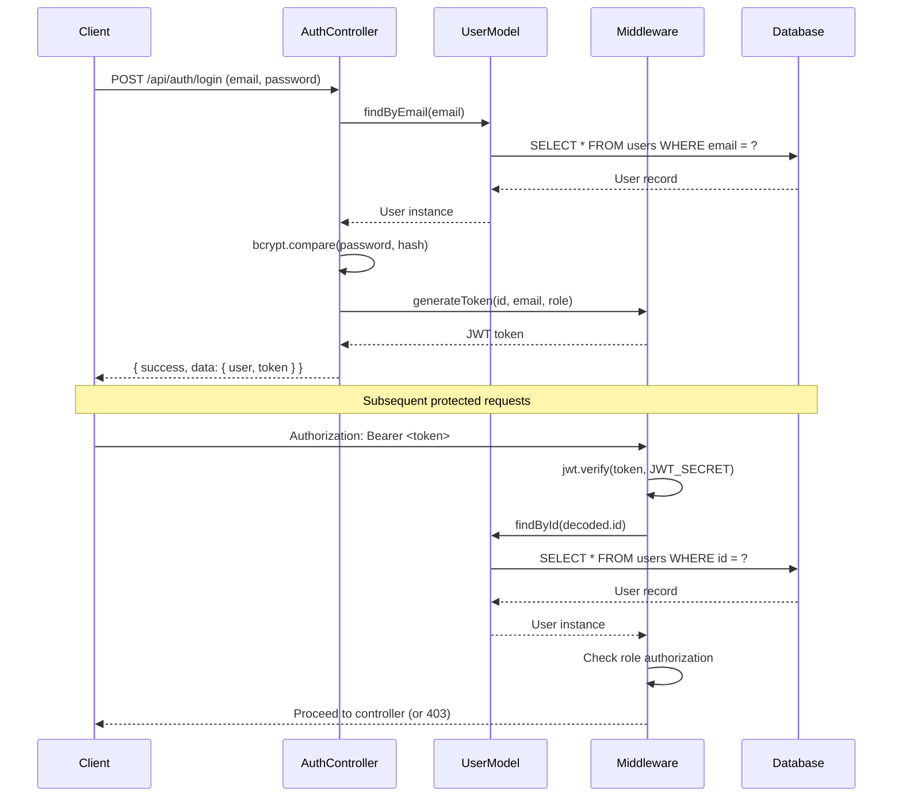
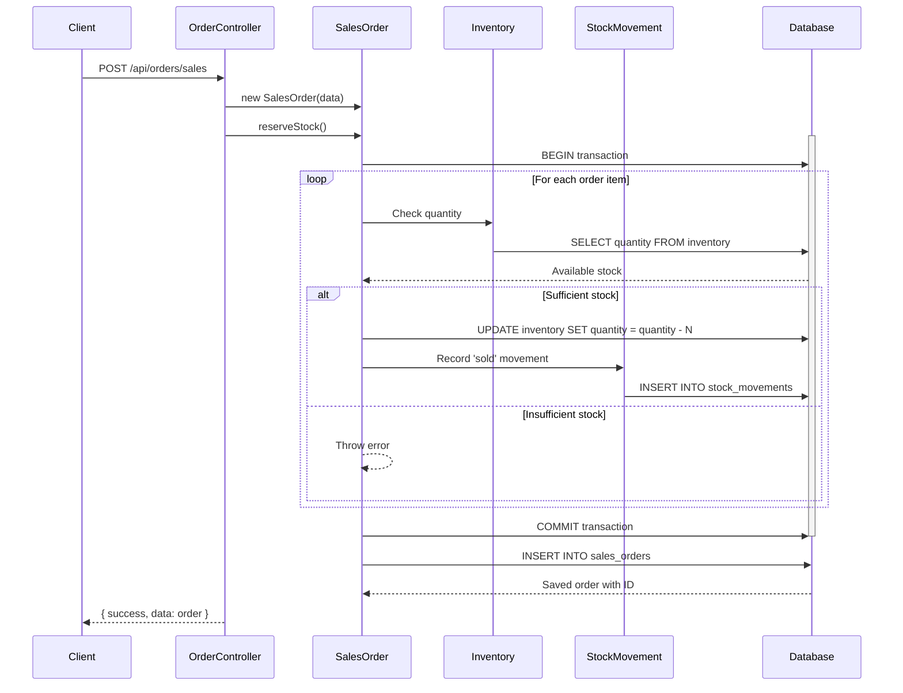
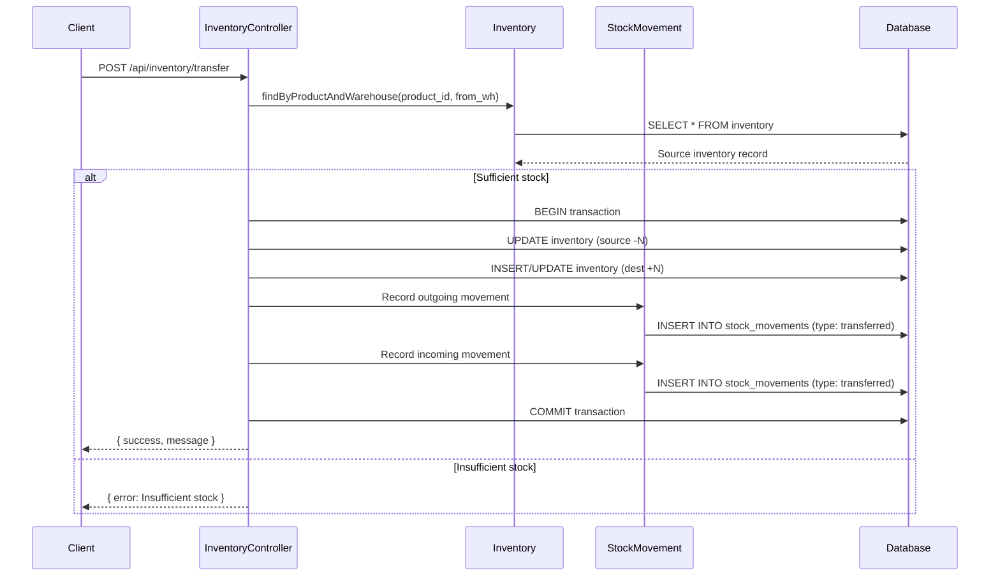

# UML Diagrams for Inventory Management System

## Class Diagram



## Sequence Diagrams

### 1. User Authentication Flow



### 2. Sales Order Creation Flow



### 3. Stock Transfer Flow



## Component Diagram

```mermaid
componentDiagram
    component "Client Layer\n(Browser/Mobile)" as Client
    
    component "Express.js API Layer" as API {
        component "Routes" as Routes
        component "Controllers" as Controllers
        component "Middleware" as Middleware {
            component "auth.js\n(JWT + RBAC)" as AuthMW
            component "permissions.js\n(Module permissions)" as PermMW
            component "sanitize.js" as SanitizeMW
            component "security.js\n(SQL injection)" as SecurityMW
        }
    }
    
    component "Business Logic Layer" as Models {
        component "BaseModel" as BaseModel
        component "User" as User
        component "Product" as Product
        component "Inventory" as Inventory
        component "SalesOrder" as SalesOrder
        component "SupplyOrder" as SupplyOrder
        component "StockMovement" as StockMov
        component "AuditLog" as AuditLog
    }
    
    component "Data Access Layer" as DAL {
        component "Connection Pool" as Pool
        component "Query Builder" as QB
    }
    
    database "PostgreSQL Database" as DB
    
    Client --> Routes : HTTP Request
    Routes --> Middleware : Route matching
    Middleware --> Controllers : Authenticated request
    Controllers --> Models : Business logic
    Models --> DAL : Data operations
    DAL --> Pool : Acquire connection
    Pool --> DB : Execute query
    DB --> Pool : Return results
    Pool --> DAL : Result rows
    DAL --> Models : Hydrated objects
    Models --> Controllers : Processed data
    Controllers --> Routes : JSON response
    Routes --> Client : HTTP Response
```

## Deployment Diagram

```mermaid
deploymentDiagram
    node "Client Devices" {
        node "Web Browser" as Browser
        node "Mobile App" as Mobile
    }
    
    node "Application Server" {
        artifact "Node.js Runtime" as NodeJS {
            artifact "Express.js App" as ExpressApp
            artifact "JWT Middleware" as JWT
            artifact "Model Classes" as Models
        }
    }
    
    node "Database Server" {
        artifact "PostgreSQL" as PostgreSQL {
            database "inventory_db" as InvDB
        }
    }
    
    Browser --> ExpressApp : HTTPS / JSON
    Mobile --> ExpressApp : HTTPS / JSON
    ExpressApp --> JWT : Token verification
    ExpressApp --> Models : Business logic
    Models --> InvDB : SQL queries via pg pool